# GraftCal — Grafting Density Calculator for Polymer-Grafted Nanoparticles

This is a Graphical User Interface (GUI) for estimating the grafting density of polymer-grafted nanoparticles (PGNPs) using localized surface plasmon resonance (LSPR)  peak-shift data and solvent-dependent refractive index analysis.

# Overview

GraftCal is a MATLAB App Designer tool for computing the grafting density of PGNP systems using experimental LSPR data from UV-Vis spectra. The application uses shell thickness, solvent-dependent peak positions, and optical modeling parameters to estimate grafting density and near-field refractive-index profiles.

Intended for researchers working with PGNPs, plasmonic nanoparticles, colloidal stability, polymer coronas, and optical characterization of nanoscale interfaces.

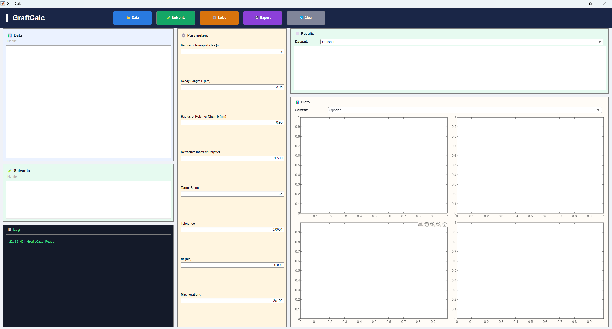

# Table of Contents

- [Method](#method)
- [Features](#features)
- [Requirements](#requirements)
- [Installation](#installation)
- [Usage](#usage)
  - [Step 1 — Prepare Your Experimental Data File](#step-1--prepare-your-experimental-data-file)
  - [Step 2 — Prepare Your Solvents File](#step-2--prepare-your-solvents-file)
  - [Step 3 — Open GraftCal](#step-3--open-graftcal)
  - [Step 4 — Import Data](#step-4--import-data)
  - [Step 5 — Import Solvents](#step-5--import-solvents)
  - [Step 6 — Configure Parameters](#step-6--configure-parameters)
  - [Step 7 — Run the Solver](#step-7--run-the-solver)
  - [Step 8 — Export Results](#step-8--export-results)
- [Output Plots](#output-plots)
- [Citation](#citation)
- [Authors](#authors)
- [License](#license)
- [Contact](#contact)

# Method

GraftCal estimates grafting density by relating LSPR peak shifts to the local refractive-index environment around PGNPs. For each grafting density trial, the model calculates the radial polymer volume fraction, converts it to a distance-dependent refractive index, and determines the effective refractive index. The solver iterates grafting density until the PGNP refractive-index sensitivity matches that of bare nanoparticles.

# Features

- GUI-based analysis using MATLAB App Designer
- Import LSPR and solvent refractive-index data from CSV or Excel files
- Estimate grafting density from solvent-dependent LSPR shifts
- Calculate polymer volume-fraction and effective refractive-index profiles
- Generate analysis plots automatically
- Export results to a multi-sheet Excel file
- Log panel for solver progress and status messages

# Requirements

| Requirement | Details |
|-------------|---------|
| MATLAB | R2020a or newer; R2023a tested |
| App Designer | Included with MATLAB |
| Toolboxes | None required |
| OS | Windows, macOS, Linux |
| Input format | `.csv` |

# Installation

**Option 1: Download ZIP**

Click the green **Code** button on GitHub, select **Download ZIP**, extract the folder, and open `GraftCal.m` in MATLAB.

**Option 2: Clone with Git**

```bash
git clone https://github.com/RPSlab/GraftCal.git
cd GraftCal
```

# Usage

## Step 1 — Prepare Your Experimental Data File

Create a CSV file with shell thickness and experimental LSPR peak positions.

| Column | Content |
|--------|---------|
| Column 1 | Shell thickness `H_nm`: hydrodynamic radius of PGNP minus bare nanoparticle core radius |
| Column 2+ | `lambda_max` values in nm for each solvent. Use one column per solvent, with a minimum of 2 solvents |

Example:

| H_nm | lambda_1 | lambda_2 | lambda_3 |
|------|----------|----------|----------|
| 15.5 | 524.1 | 529.6 | 526.8 |
| 20.3 | 523.7 | 528.4 | 528.1 |
| 25.1 | 523.2 | 527.5 | 525.4 |

## Step 2 — Prepare Your Solvents File

Create a separate CSV file with one row of solvent refractive indices. Column count must match the number of Lambda Max columns in your data file.

Example:

| n_solv_1 | n_solv_2 | n_solv_3 |
|----------|----------|----------|
| 1.33 | 1.45 | 1.55 |

## Step 3 — Open GraftCal

In MATLAB, open and run:

```matlab
GraftCal.m
```

The app opens with a welcome screen. Click ▶ **Start Using App** to proceed.

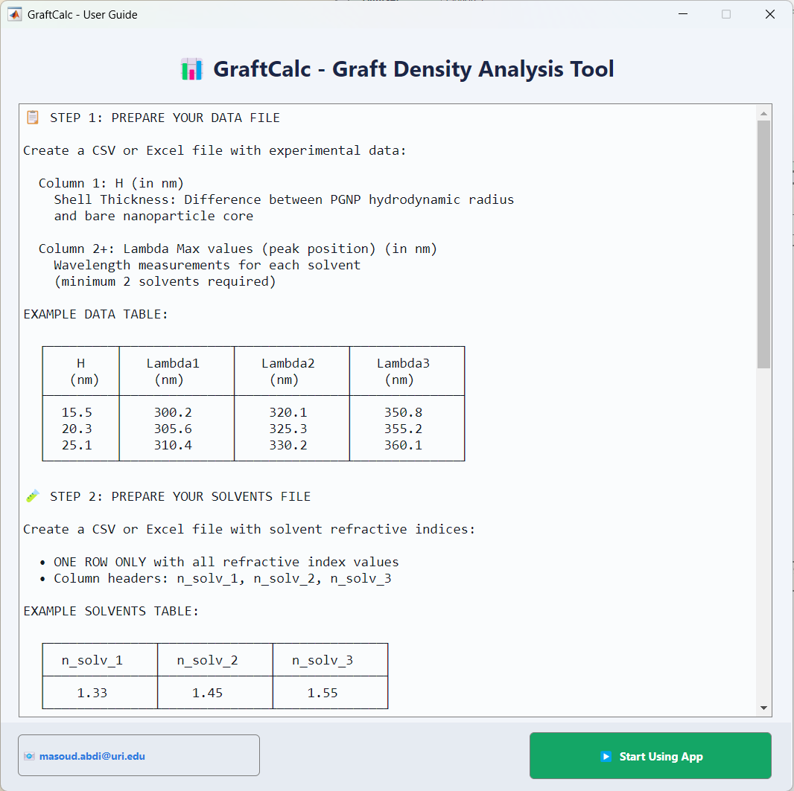

## Step 4 — Import Data

Click 📂 **Data** and select your experimental CSV file. The data table populates in the left panel with a green checkmark confirming successful import.

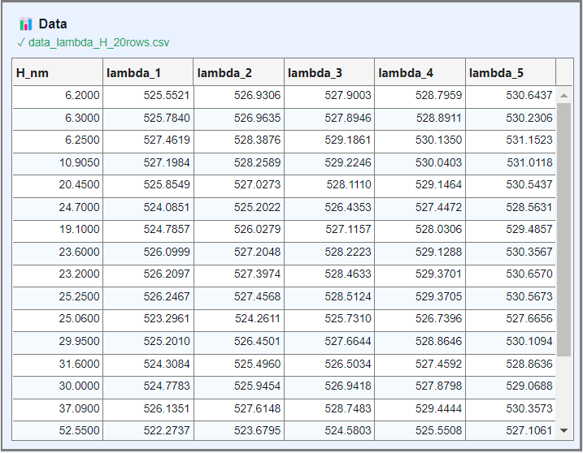

## Step 5 — Import Solvents

Click 🧪 **Solvents** and select your solvents CSV file. The refractive index values appear in the solvents panel.

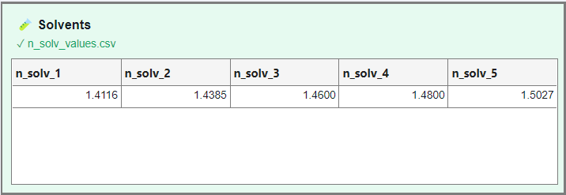

## Step 6 — Configure Parameters

Enter the following parameters in the GUI based on the type and size of the metallic nanoparticle:

| Parameter | Description |
|-----------|-------------|
| `R_NP` | Radius of the bare nanoparticle core in nm |
| `L` | Characteristic plasmonic near-field decay length in nm |
| `b` | Effective polymer chain radius parameter in nm |
| `n_polymer` | Refractive index of the grafted polymer layer |
| `Target slope` | Linear slope of LSPR peak shift vs. solvent refractive index from Mie theory or experiment |
| `Tolerance` | Numerical precision of the solver |
| `dz` | Spatial step size for refractive-index profile integration in nm |
| `Max iterations` | Maximum solver cycles before stopping |

Example (for 7nm AuNPs and grafted Polystyrene):

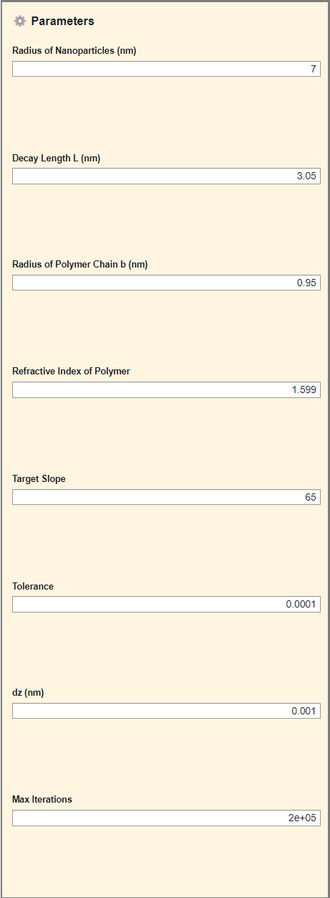

## Step 7 — Run the Solver

Click ⚙️ **Solve**. The log panel shows solver progress in real time. After completion, four plots populate automatically. Use the **Solvent** dropdown in the Plots panel to switch between solvent-specific profiles.

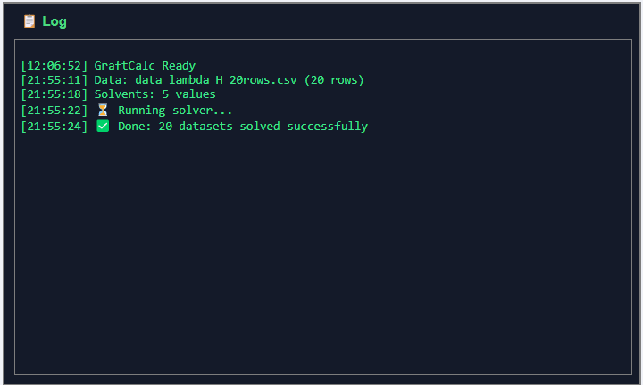

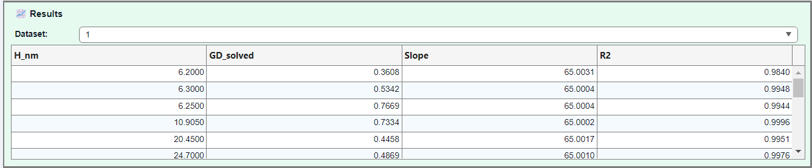

## Step 8 — Export Results

Click 💾 **Export** to save results as a multi-sheet Excel file. Export progress is shown in the GUI progress bar.

# Output Plots

GraftCal generates four plots per dataset automatically after each solve:

| Plot | Description |
|------|-------------|
| Volume Fraction Profile | Polymer volume fraction φ(z) vs. radial distance from the nanoparticle surface |
| Refractive Index Profile | Distance-dependent refractive index n(z) for the selected solvent |
| Lambda vs Solvent | LSPR peak position vs. solvent refractive index with measured slope |
| Lambda vs Effective | LSPR peak position vs. computed effective refractive index, confirming solver convergence to target slope |

Example:

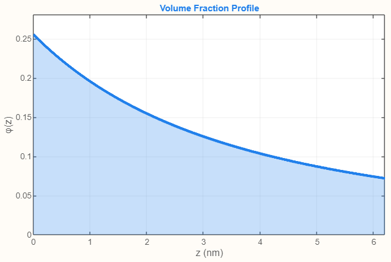

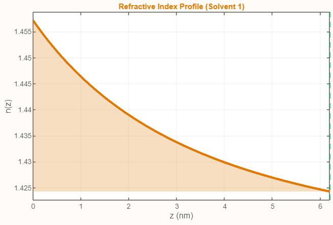

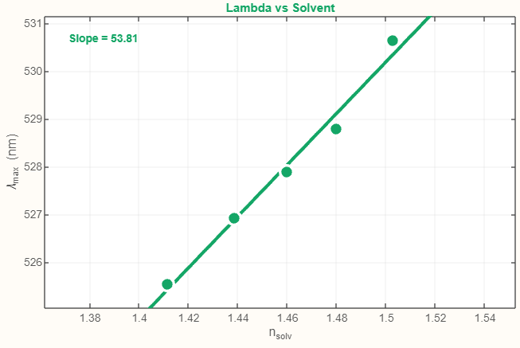

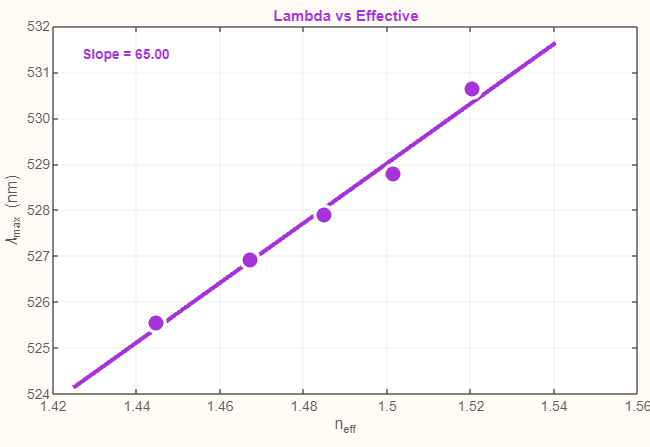

# Citation

If you use GraftCal in your research, please cite:

> *Citation to be added upon publication.*

# Authors

**Masoud Abdi**
Ph.D. Student, Department of Chemical, Biomolecular, and Materials Engineering, University of Rhode Island
Code development and data analysis
📧 masoud.abdi@uri.edu

**Prof. Ryan Poling-Skutvik**
Department of Chemical, Biomolecular, and Materials Engineering, University of Rhode Island
Project supervision and scientific advising
📧 ryanps@uri.edu

**Prof. Irene Andreu**
Department of Chemical, Biomolecular, and Materials Engineering, University of Rhode Island
Project supervision and scientific advising
📧 iandreu@uri.edu

# License

Distributed under the MIT License. See `LICENSE` for details.

# Contact

For questions, bug reports, or collaboration inquiries:

**Prof. Ryan Poling-Skutvik**
📧 ryanps@uri.edu
